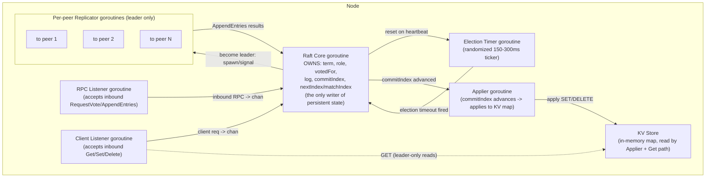

# Quorum

A distributed, replicated key-value store built on a from-scratch implementation of the Raft consensus algorithm, in Go.

Quorum is the systems/infra project in my portfolio: it extends the concurrency work in [Pulse](https://github.com/Aryantyagi-2003) (goroutines, channels, single-node concurrent design) into genuinely distributed-systems territory — leader election, log replication, and partition tolerance across a multi-node cluster that must keep working (or correctly refuse to) when nodes crash and the network splits.

**Status: Phase 1 complete.** Single-node storage engine and client wire protocol are implemented and tested. Raft consensus (leader election, log replication, multi-node clustering) has not been built yet — see [Build Plan & Status](#build-plan--status) below.

## Why build Raft from scratch

The point of this project is to demonstrate understanding of consensus, replication, and persistence — not to demonstrate the ability to call a library that already provides them. So:

- No `hashicorp/raft`, no `etcd`'s raft package — the algorithm itself (leader election, log matching, commit-index advancement, the term-based safety rules) is implemented directly in this repo, with comments citing the specific section of the Raft paper (Ongaro & Ousterhout, *"In Search of an Understandable Consensus Algorithm"*) each piece implements.
- No gRPC/protobuf for the core RPC layer, either — code-generated RPC stubs would hide the wire protocol and the dispatch logic, which is exactly the part worth showing here.

## Design decisions

### Wire protocol: length-prefixed JSON over TCP

Every RPC — inter-node `RequestVote`/`AppendEntries`, and client-facing `Get`/`Set`/`Delete` — is framed as a 4-byte big-endian length prefix followed by a JSON body:

```
[4 bytes: uint32 length N][N bytes: JSON body]
```

This was chosen over `net/rpc` because `net/rpc`'s reflection-based dispatch and gob encoding would do the framing and dispatch *for* me — the whole point is to write that layer myself. JSON over a hand-rolled binary format (rather than designing a fully custom binary wire format) because these RPCs are small and infrequent relative to typical network throughput (heartbeats on the order of tens of milliseconds, not a hot data path), so encoding overhead doesn't matter here — while JSON keeps every captured chaos-test log human-readable directly from a packet capture or log file, which matters a lot for a README whose entire point is showing real captured output.

See [`internal/proto`](internal/proto).

### Persistent state: split hardstate + hand-rolled append-only log

Two files per node, split because they have very different write patterns:

- **`hardstate.json`** — `currentTerm` and `votedFor`, rewritten via write-to-temp-file-then-atomic-rename on every change (small, frequent, must never leave a half-written file for the next startup to misread).
- **`log.dat`** — the replicated log itself, a hand-rolled append-only binary format rather than BoltDB or another embedded KV engine. The log's access pattern is: append to the tail constantly, and occasionally truncate the tail on a conflict (Raft paper §5.3) — never touch the middle. A flat append-only file with per-record CRC32 checksums is the right shape for that pattern, and a B-tree-backed engine like BoltDB would be solving a problem (arbitrary-key random access) this workload doesn't have. Each record is `[4B recordLen][8B term][8B index][4B commandLen][command bytes][4B CRC32]`; at startup the file is replayed fully into memory, and a record that fails its CRC check (or is truncated by a crash mid-write) is treated as an incomplete final write and the file is truncated back to the last known-good record, rather than treated as corruption of the whole log.

See [`internal/storage`](internal/storage).

**Known limitation:** log compaction / snapshotting is not implemented. The log grows unboundedly for the life of the cluster. This is explicitly out of scope for this project (per the original plan) rather than a silent omission — see [Known Limitations](#known-limitations).

### Linearizability vs. stale reads

*(This section applies once Raft is wired in — Phase 1 has no replication, so this decision hasn't taken effect yet, but the client protocol already reflects it.)*

Quorum will serve `GET` only from the current leader, matching `SET`/`DELETE` — a follower response to `GET` will be `not leader` with a leader hint, exactly like a write. This is a deliberate choice of strict linearizability over follower-read scalability: the whole point of this project is to demonstrate correct consistency guarantees, not throughput, so the standard read-scaling optimizations (leader leases, the read-index protocol) are documented as unimplemented stretch goals rather than built in.

### Client protocol: leader discovery + retry semantics

*(Also takes effect once multi-node clustering exists.)*

The client (`quorumctl`, and the `ClientRequest`/`ClientResponse` protocol it uses) is designed so that:

- A node that isn't the leader responds `not leader` with a `leaderHint` when it knows who the leader is, or `no leader` if an election is in progress — the client never hangs waiting for a response.
- Every write request carries `ClientID` + `SeqNum` (Raft paper §8). This is what makes client retries safe: if a client's request reaches a leader that then loses leadership before the entry commits, the correct behavior is for the client to retry (against the new leader) — and if that retry causes the same command to be appended to the log twice, `kvstore.Store.Apply` deduplicates by `(ClientID, SeqNum)` so it's applied at most once. This is already implemented and unit-tested in [`internal/kvstore`](internal/kvstore) even though there's only one node to exercise it against so far.

## Architecture



Each concern owns exactly one goroutine, communicating over channels — the same hub pattern used in Pulse, adapted so **Raft Core** is the single writer of all consensus state (term, role, log, commit index, per-peer `nextIndex`/`matchIndex`). No locks are needed around Raft state because only one goroutine ever touches it; this also makes the state-transition logic unit-testable in isolation by feeding Core canned channel messages against a fake transport, without opening any real sockets.

*(Phase 1, currently implemented, is simpler than the diagram above: a single [`internal/server`](internal/server) listener writes directly through the durable log to the KV store, with no Raft Core, no elections, and no replication. The diagram describes the target architecture for Phase 2 onward.)*

## Build Plan & Status

Built in stages, verifying each before moving to the next — per the project plan, election bugs and replication bugs are not debugged simultaneously.

- [x] **Phase 1 — Single-node KV store, no replication.** Storage engine (`internal/storage`: hardstate + append-only log with CRC32 + crash-recovery truncation) and client wire protocol (`internal/proto`, `internal/kvstore`, `internal/server`) working end-to-end via `quorumd`/`quorumctl`. Verified manually: `SET`/`GET`/`DELETE`, `kill -9` mid-session, restart, confirm all committed state (correctly including deletes) survived the crash. Unit tests cover log append/replay/truncate/crash-recovery, proto framing, and KV dedup semantics; all pass under `go test -race`.
- [ ] **Phase 2 — Leader election in isolation.** 3+ nodes, no log replication yet — just verify elections happen correctly and converge to a single leader per term.
- [ ] **Phase 3 — Log replication** on top of working elections: `AppendEntries`, `nextIndex`/`matchIndex` tracking, log matching property, conflict resolution.
- [ ] **Phase 4 — Full KV state machine** wired through the committed log (replacing the Phase 1 direct-write path).
- [ ] **Phase 5 — Chaos-testing harness**: leader-crash-mid-write, network partition / split-brain, concurrent-writes-under-failover, and sustained fault injection scenarios, with real captured output.

## Known Limitations

- **No log compaction / snapshotting.** The replicated log grows unboundedly for the lifetime of the cluster. This is an explicitly accepted scope limitation for this project, not an oversight — a production system would need this to bound disk usage and replay time on restart.
- **`-race` is necessary but not sufficient.** `go test -race` catches data races within a single process's memory; it says nothing about distributed correctness (a bug where two nodes disagree about committed state, for instance, will never trigger a race detector). The real correctness evidence for this project's distributed guarantees is the chaos-testing harness (Phase 5) and its captured output, not the unit test suite.

## Usage (Phase 1)

```sh
make build

# terminal 1
./bin/quorumd -addr 127.0.0.1:7000 -data-dir ./data/node1

# terminal 2
./bin/quorumctl -addr 127.0.0.1:7000 set foo bar
./bin/quorumctl -addr 127.0.0.1:7000 get foo
./bin/quorumctl -addr 127.0.0.1:7000 delete foo
```

Kill the node (`kill -9`) and restart it against the same `-data-dir`: previously committed writes are replayed from `log.dat` and are present again.

## Repository layout

```
cmd/quorumd/     node server binary
cmd/quorumctl/   CLI client
internal/proto/  wire protocol: RPC structs + length-prefixed JSON framing
internal/storage/ hardstate.json + log.dat persistence
internal/kvstore/ in-memory KV state machine (applied from the committed log)
internal/server/  Phase 1 single-node client-request dispatch (pre-Raft)
```
